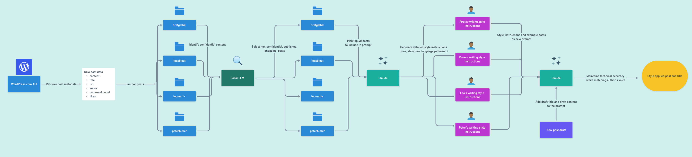

# WordPress Author Style Imitator

A tool that analyzes an author's writing style from their WordPress.com blog posts and helps generate new content that mimics their unique voice.

*Pipeline diagram showing the flow from WordPress.com API through style analysis to final content generation*

## How It Works

The tool follows a four-stage pipeline as shown in the diagram above:

1. **Data Collection**: Fetches posts and metadata from WordPress.com API
2. **Content Classification**: Uses local LLM to filter out confidential content
3. **Style Analysis**: Leverages Claude to generate comprehensive style instructions
4. **Style Application**: Applies captured style patterns to new content

## Project Structure

- `src/`: Contains the source code for the project
  - `auth/`: Authentication related code.
  - `notebooks/`: Jupyter notebooks for the main pipeline
  - `utils/`: Utility functions and helpers
- `data/`: Contains the processed data (not included in repo)
  - `author_posts/`: Raw posts by author
  - `classified_posts/`: Posts after confidentiality classification
  - `author_instructions/`: Generated writing style instructions
  - `post_instructions/`: Style-applied drafts

## Setup

1. Clone this repository
2. Create a `.env` file in the root directory with:
   - `WPCOM_CLIENT_SECRET`: WordPress.com API client secret
   - `WPCOM_ACCESS_TOKEN`: WordPress.com API access token
   - `ANTHROPIC_API_KEY`: Anthropic API key for Claude
3. Install required packages using Poetry: `poetry install`

## Notebooks

1. Obtain WordPress.com API credentials and set up an app (see [WordPress.com API documentation](https://developer.wordpress.com/docs/))
2. Get an Anthropic API key for Claude 3.5
3. Run `auth_get_token.py` to obtain an access token
4. Execute notebooks in the following order:
  - `retrieve_posts.ipynb`
  - `llm_classify_posts.ipynb`
  - `llm_generate_author_prompts.ipynb`
  - `llm_apply_author_style.ipynb`

### retrieve_posts.ipynb
Fetches blog posts and engagement metrics from WordPress.com API. The notebook:
- Retrieves posts using WordPress.com REST API
- Collects metadata (views, likes, comments)
- Handles rate limiting and pagination
- Saves posts organized by domain and author
- Processes cross-posts between different WordPress.com sites

### llm_classify_posts.ipynb
Uses a local LLM to identify and filter out posts containing confidential information. The notebook:
- Processes the top 50 posts by engagement score
- Uses Ollama with Qwen 2.5 model for classification
- Identifies sensitive/confidential content
- Saves classification results with reasoning
- Filters out confidential posts from further processing

### llm_generate_author_prompts.ipynb
Analyzes non-confidential posts to generate comprehensive writing style instructions. The notebook:
- Takes filtered posts from previous step
- Uses Claude 3.5 to analyze writing patterns
- Generates detailed style instructions covering:
  - Tone and voice
  - Content structure
  - Language patterns
  - Technical depth
  - Engagement techniques
- Saves instructions for use in content generation

### llm_apply_author_style.ipynb
Applies the generated style instructions to new content. The notebook:
- Takes a draft post as input
- Uses style instructions and example posts
- Leverages Claude 3.5 to rewrite content
- Maintains technical accuracy while matching author's voice
- Saves the style-applied output

## Use Cases

### Content Creation and Editing
- Writing assistants that adapt to your team's voice
- Draft refinement while maintaining consistent style
- Technical documentation with consistent tone across teams
- Blog post generation matching established author voices

### Marketing and Communications
- Content generation for different brand personas
- Consistent messaging across multiple channels
- Newsletter and marketing email writing
- Campaign content that maintains brand voice

### Learning and Development
- Style analysis for writing improvement
- Understanding different writing approaches
- Learning from experienced writers' patterns
- Continuous feedback on writing habits

### Localization and Accessibility
- Style-aware content adaptation
- Maintaining voice consistency in translations
- Adapting technical content for different audiences
- Accessibility-focused content rewrites

## Benefits and Insights

- **Style Preservation**: Captures and maintains unique writing voices while generating new content
- **Learning Tool**: Helps understand and learn from different writing styles
- **Efficiency**: Streamlines content creation while maintaining consistency
- **Flexibility**: Adapts to different writing styles and content types
- **Quality Control**: Ensures consistent voice across multiple pieces of content

## Note on Data Privacy

This repository intentionally excludes input and output data as the development used internal blog posts from Automattic. When using this tool, ensure you have appropriate permissions for the blog posts you analyze.

## License

This project is licensed under the MIT License - see the [LICENSE](LICENSE) file for details.
